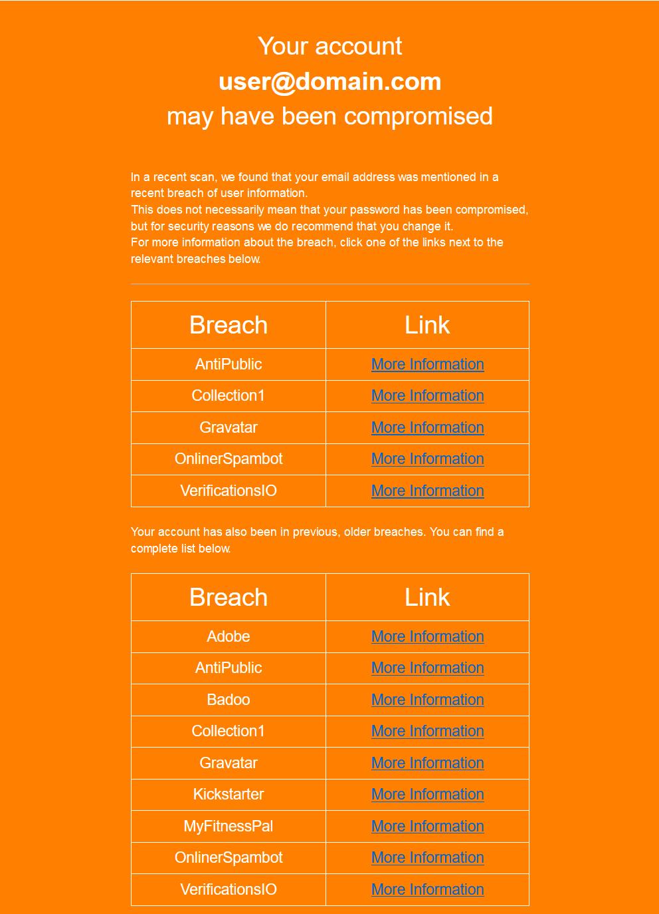

# Have I Been Pwned Notifier
Notifies users when their details have been in a data breach based on the HIBP API.

## How it works
1. Checks the HIBP API to see what the latest breach is
2. If the breach is the one mentioned in the configuration file, exit
3. If it is a new breach, get all breached users from the domains endpoint for all domains in the config
4. Check if a user has been in a breach that is not in the "notifiedBreaches" list
5. If they're in that list, send them an email with the new breach and a list of old breaches their account has been in as well

## Configuration
```json
{
  # Have I been Pwned API Key
    "hibpApiKey": "",

  # Domains to check for breaches
  # All domains here have to be verified on the HIBP dashboard before usage
    "domains": [
        "domain.com"
    ],

  # The latest breach that the script has notified users about
    "latestBreach": "VTech",

  # Breaches that the script has already notified users about
    "notifiedBreaches": [
        "Spytech",
        "Adobe",
        "Badoo",
        "Kickstarter",
        "MyFitnessPal"
    ],

  # SMTP Settings
    "smtp": {
        "sender": "mailer@domain.com",
        "host": "smtp.domain.com",
        "port": 25,
        "secure": false,
        "starttls": true,
        "user": "username",
        "pass": "password"
    },

  # Ignore breaches of certain types
  # To read more, visit https://haveibeenpwned.com/API/v3#BreachModel
    "ignore": {
        "unverified": false,
        "fabricated": false,
        "sensitive": false,
        "retired": false,
        "spamList": false,
        "malware": false
    },
    
    # Settings for colors and texts in the email sent to the users
    # You can also provide your own custom email template. For substitutions, check below
    "email": {
        "colors": {
            "background": "#ff8000",
            "text": "#ffffff"
        },
        "subject": "Your account might have been compromised",
        "body": {
            "header": "Your account might have been compromised",
            "texts": [
                "In a recent scan, we found that your email address was mentioned in a recent breach of user information.",
                "This does not necessarily mean that your password has been compromised, but for security reasons we do recommend that you change it.",
                "For more information about the breach, click one of the links next to the relevant breaches below."
            ],
            "previous_breach_texts": [
                "Your account has also been in previous, older breaches. You can find a complete list below."
            ]
        }
    }
}
```


## Email Template Substitutions
| Placeholder | Description | Example | Value From |
|-------------|-------------|---------|------------|
| `{{text_color}}` | The color of the text in the email | `#ffffff` | config.json |
| `{{bg_color}}` | The color of the background in the email | `#ff8000` | config.json |
| `{{body_text}}` | The body text section from the configuration file | `In a recent scan, we found that your email address was mentioned in a recent breach of user information.` | config.json |
| `{{previous_breaches_text}}` | The text that is shown before the list of previous breaches | `Your account has also been in previous, older breaches. You can find a complete list below.` | config.json |
| `{{username}}` | The email of the user that was in the breach | `user@domain.com` | HIBP API |
| `{{new_breach_rows}}` | The list of new breaches that the user was in | `<tr><td>BreachA</td><td>Link to BreachA</td></tr>` | HIBP API |
| `{{previous_breaches_rows}}` | The list of previous breaches that the user was in | `<tr><td>BreachA</td><td>Link to BreachA</td></tr>` | HIBP API |

## Default email image
This is the default image. You can change it by replacing the email_template.html with your own version.

